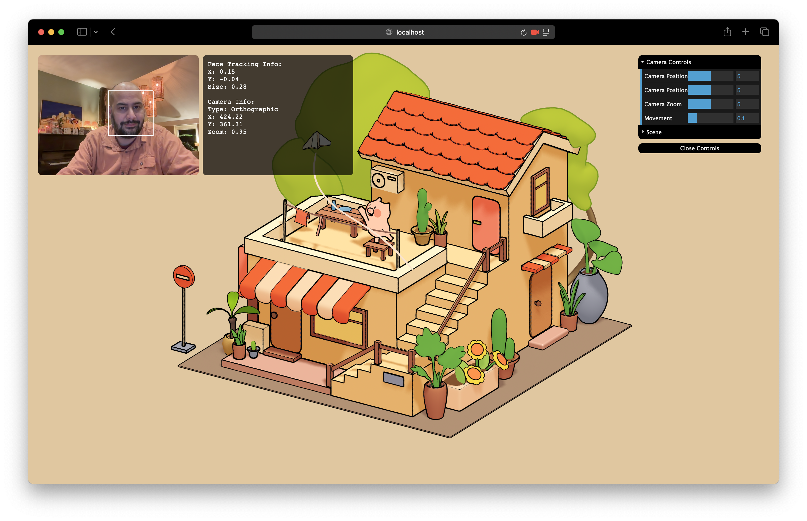
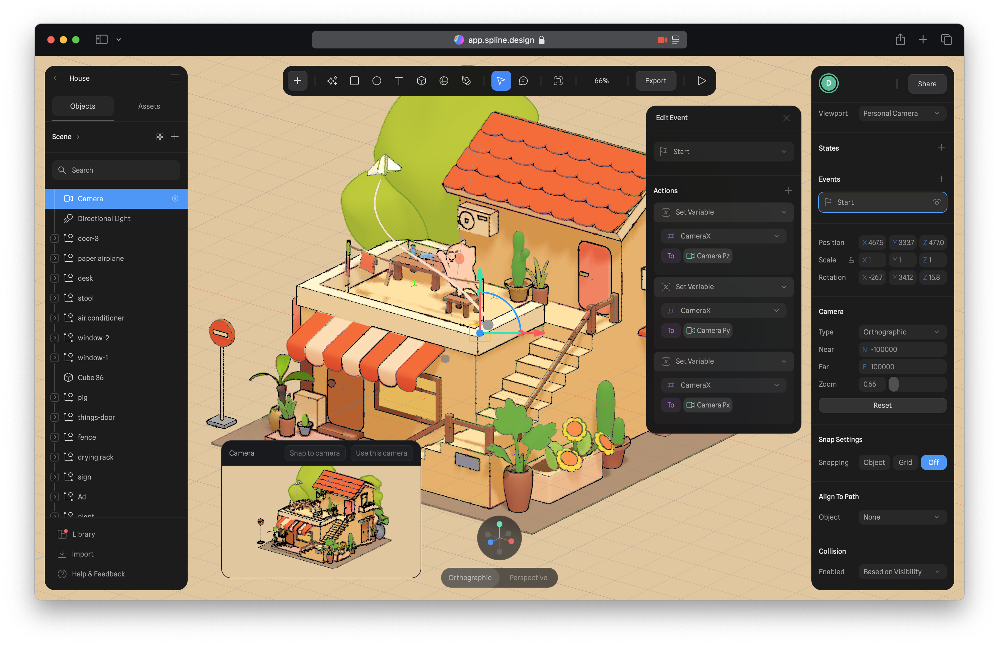

# 3D Face Tracking Camera Control



A web application that uses face tracking to control a 3D camera in Spline scenes. The application tracks your face movements through your webcam and maps them to camera movements in the 3D scene.

## Features

- Real-time face tracking using OpenCV.js
- Camera position control through head movement
- Camera zoom control through forward/backward head movement
- Support for both orthographic and perspective cameras
- Adjustable sensitivity and smoothing controls
- Live debug overlay showing tracking data
- Easy scene switching through URL input

## How It Works

The application uses your webcam to track your face position and maps it to camera movements in the 3D scene:

- Moving your head left/right → Camera moves right/left
- Moving your head up/down → Camera moves down/up
- Moving closer/further → Camera zooms in/out (in orthographic mode) or moves forward/backward (in perspective mode)

## Controls

The control panel provides several adjustments:

- **Camera Position X**: Sensitivity of left/right movement
- **Camera Position Y**: Sensitivity of up/down movement
- **Camera Zoom**: Sensitivity of zoom/depth movement
- **Movement Smoothing**: How smoothly the camera follows your movement (lower = smoother but more latency)

## Setting Up Your Own Scene

1. Create your scene in Spline
2. Set up the camera:
   - Select your camera in the Objects panel
   - For best results, use Orthographic camera type
   - Make sure the camera is not locked or constrained

3. Set up camera variables in Spline:
   - Select your camera in the Objects panel
   - In the Events panel, create a "Start" event
   - Add three "Set Variable" actions:
     - `CameraX`: Link to Camera Position X
     - `CameraY`: Link to Camera Position Y
     - `CameraZ`: Link to Camera Position Z

Here's how your Spline settings should look:


4. Export your scene:
   - Click the "Export" button in Spline
   - Choose "Web" as the export type
   - Copy the scene URL (it should end with `.splinecode`)

5. Load your scene:
   - In the application, expand the "Scene" folder in the controls
   - Paste your scene URL in the "Scene URL" field
   - Click "Load Scene" to apply

## Camera ID Setup

If your camera's ID is different from the default:

1. Find your camera's ID in Spline:
   - Select the camera in your scene
   - Look for the ID in the properties panel or export data

2. Update the camera ID in `app.js`:
   ```javascript
   const CONFIG = {
       CAMERA_ID: 'your-camera-id-here'
   };
   ```

## Keyboard Shortcuts

- Press `1` to toggle visibility of the video feed, debug overlay, and controls

## Technical Details

The application uses:
- OpenCV.js for face detection
- Spline Runtime for 3D scene rendering
- dat.GUI for the control interface

The face tracking process:
1. Captures video frames from your webcam
2. Processes frames using OpenCV's face detection
3. Calculates normalized position values
4. Applies sensitivity and smoothing
5. Updates camera position/zoom in the Spline scene

## Development

To run the project locally:

1. Clone the repository
2. Start a local server (e.g., `python3 -m http.server 8000`)
3. Open `http://localhost:8000` in your browser
4. Allow camera access when prompted

## Troubleshooting

If the camera movement isn't working:
1. Check the debug overlay to confirm face tracking is working
2. Verify your scene's camera ID matches the one in CONFIG
3. Make sure your camera isn't locked in the Spline scene
4. Try adjusting the sensitivity and smoothing values
5. Check the browser console for any error messages 